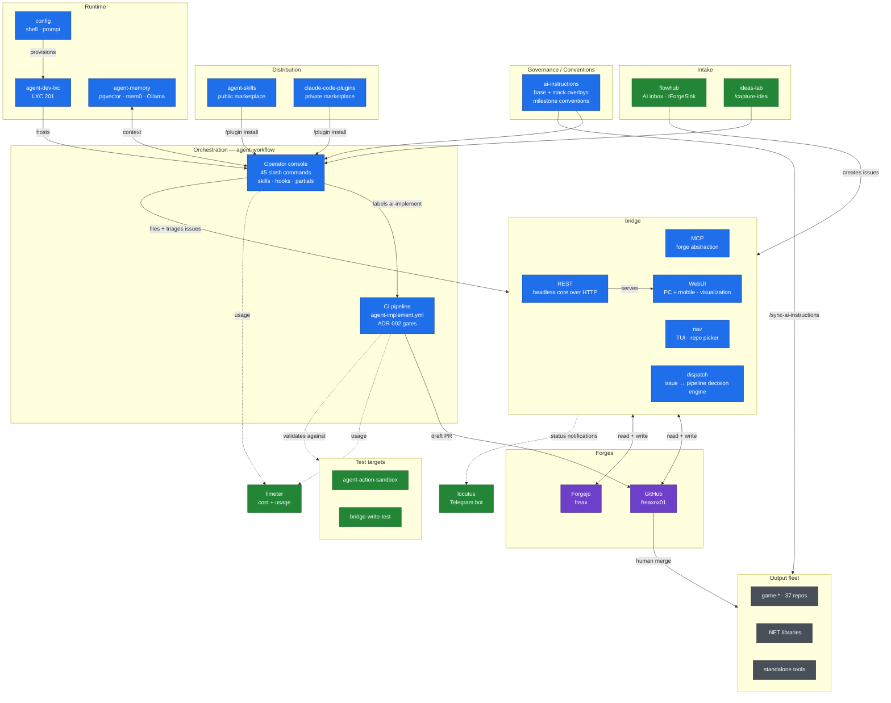

# agent-workflow

The personal Issue→PR pipeline, end to end: the **CI side** that runs Claude Code
in GitHub Actions, and the **operator console** — the user-level slash commands you
drive it with.

Two halves, one repo (see [ADR-005](docs/DECISIONS.md)):

| Half | Lives in | What it is |
|---|---|---|
| **CI pipeline** | `.github/workflows/`, `.github/actions/`, `scripts/`, `gate-tests/` | Reusable workflows a consumer repo calls with a ~15-line stub, plus the quality gates and their self-tests |
| **Operator console** | `commands/`, `skills/`, `hooks/`, `setup/` | 45 forge-agnostic slash commands, the user-level skills, and the `handoff-resume` hook — installed once into `~/.claude/` and available in every repo |

Design notes: [`docs/DESIGN.md`](docs/DESIGN.md) · decisions: [`docs/DECISIONS.md`](docs/DECISIONS.md) · consumer onboarding: [`docs/CONSUMER-SETUP.md`](docs/CONSUMER-SETUP.md) · glossary: [`docs/glossary.md`](docs/glossary.md)

---

## Diagram

Source of truth: [`docs/FACTORY-MAP.md`](docs/FACTORY-MAP.md). Use the pan/zoom
controls in the top-right corner of the diagram to view it fullscreen, or open the
[standalone fullscreen page](http://github.freaxnx01.ch/agent-workflow/) (diagram only, press F11).



Blue = core · green = supporting · purple = forges · grey = output.
Dotted edges are observation/validation rather than data flow.

---

## Slash commands — where they come from and how they get there

Claude Code resolves `/commands` from **four independent sources**. Nothing merges
them; they simply coexist, and the union is what `/` autocomplete shows. Knowing
which source a command came from tells you where to edit it and how to refresh it.

| # | Source of truth (repo) | Installed to | Mechanism | Scope |
|---|---|---|---|---|
| 1 | `freaxnx01/agent-workflow` → `commands/**` | `~/.claude/commands/**` | **copied** by [`setup/link-commands.sh`](setup/link-commands.sh) | **Every repo** on the machine |
| 2 | `freaxnx01/agent-skills` (marketplace `freax-agent-skills`) | `~/.claude/plugins/cache/freax-agent-skills/` | `/plugin install` | **Every repo** |
| 3 | `freaxnx01/ai-instructions` → `.ai/skills/**` | target project's `.claude/commands/**` | written by `/sync-ai-instructions` | The synced repo only |
| 4 | Any project's own `.claude/commands/**` | — (read in place) | committed to that repo | **That repo only** |

### 1 — This repo: the user-level console

`commands/` is the source of truth for the global commands. Subfolders become `:`
namespaces, so `commands/work.md` is invoked as `/work`.

```text
commands/
  gh/    → /gh:assign  /gh:implement  /gh:implementation-contract  /gh:review
  wt/    → /wt:status  /wt:finish
  *.md   → /handoff  /pickup  /todo  /wrap-up  /loose-ends  /clear-check
           /issues  /prs  /triage  /queue  /route  /work  /milestone  /new  /enrich
           /enrich-phased  /parked  /roadmap  /done  (forge-agnostic)
           /capture-idea  /commands  /update-commands
```

`setup/link-commands.sh` installs them into `~/.claude/commands/`, preserving the
subfolder layout. **The default is `cp`, not `ln -s`** — deliberate, so the installed
console doesn't silently follow whatever branch this checkout happens to be on (it
would vanish entirely on a branch predating the console). The trade-off: **`git pull`
here does not update your commands — re-run the installer.**

| Flag | Effect |
|---|---|
| *(none)* | Copy — the default |
| `--link` | Symlink into this working tree; use while actively editing commands |
| `--copy` | No-op, accepted for compatibility |
| `--no-sync` | Skip the clone/pull, install from the current tree as-is |

Because they live under `$HOME`, these commands are **not** copied into individual
repos and don't need to be. `/work` works in a non-coding repo (`org`) exactly as it
does in a code repo — Claude Code reads `~/.claude/commands/` regardless of the working
directory.

Hooks follow the same pattern: [`setup/link-hooks.sh`](setup/link-hooks.sh) copies
`hooks/handoff-resume.sh` to `~/.claude/hooks/` **and** wires it into
`~/.claude/settings.json` (backing the file up first). The copy under `$HOME` is what
executes, not the file in this repo.

`partials/` follows the same pattern for CLAUDE.md content: `@`-imported
fragments, installed by [`setup/link-partials.sh`](setup/link-partials.sh) into
`~/.claude/CLAUDE.md`, so they apply to every project on the machine. New `*.md`
files dropped into `partials/` are picked up automatically on the next install.

| File | Good for |
|---|---|
| [`task-checklist.md`](partials/task-checklist.md) | Getting action items back as `- [ ]` Markdown checkboxes instead of prose, so they're easy to tick off and reference by number. |
| [`skill-authoring.md`](partials/skill-authoring.md) | Making self-authored skills self-improving — each one is told to fix its own blockers and write the fix back into `SKILL.md` for next time. |
| [`subagent-driven-default.md`](partials/subagent-driven-default.md) | Defaulting implementation-plan execution to `superpowers:subagent-driven-development` instead of inline work, without having to ask for it each time — except issue-based plans in agent-workflow-enabled repos, which dispatch via `/gh:implement` instead. |
| [`scope-boundary.md`](partials/scope-boundary.md) | Avoiding scope creep — state scope up front, treat incidental findings as discoveries to capture (not auto-tasks), and ask before a fix chain drifts into a different project. |

See [`partials/README.md`](partials/README.md) for setup and verification steps —
that file isn't itself imported, it documents the directory for humans.

New machine, one line:

```bash
curl -fsSL https://raw.githubusercontent.com/freaxnx01/agent-workflow/main/setup/bootstrap.sh | bash
```

Full command list: [`commands/README.md`](commands/README.md).

### 2 — Plugin skills from `agent-skills`

`/sync-ai-instructions` and `/propose-ai-instructions` are **not** in this repo. They
are plugin skills published from a separate repo:

```text
upstream:     github.com/freaxnx01/agent-skills
marketplace:  freax-agent-skills
installed at: ~/.claude/plugins/cache/freax-agent-skills/
```

```text
/plugin marketplace add freaxnx01/agent-skills
/plugin install sync-ai-instructions@freax-agent-skills
/reload-plugins
```

Plugin-provided commands are global like the user-level ones, but they update through
`/plugin` — **not** through `/update-commands`.

### 3 — Commands delivered by `/sync-ai-instructions`

`ai-instructions` keeps shared skills under `.ai/skills/`: `commit` and `push`.
Running `/sync-ai-instructions <stack>` in a target project writes them into that
project's `.claude/commands/`, alongside the assembled `CLAUDE.md`. Once written they
behave as source 4 — project-scoped, committed to the consuming repo.

> The **four-phase UI workflow** (`/ui:brainstorm` → `/ui:flow` → `/ui:build` →
> `/ui:review`) used to ship here via sync. It now lives in the console as the `ui/`
> namespace (source 1) — global, installed once into `~/.claude/commands/`, so it
> works in every repo without a per-project sync. See
> [`commands/README.md`](commands/README.md) for the gated-sequence details.

### 4 — Project-scoped commands

A repo may ship its own `.claude/commands/`, active only inside that repo — whether
written by hand or delivered by source 3. They are read in place: nothing installs or
copies them, and they do not follow you to other repos.

This repo ships `/commit` and `/push` in
[`.claude/commands/`](.claude/commands/); `ai-instructions` ships the same pair plus
`/release-notes`. (The `ui-*` phases moved to the global console — see source 1.)

When a name collides with a user-level command, the project-scoped one wins.

### Refreshing

```bash
# partials + commands + hooks + skills — one idempotent installer, one repo
bash ~/repos/github/freaxnx01/public/agent-workflow/setup/bootstrap.sh
```

`/update-commands` is a thin wrapper around exactly that, and reports what changed.
This repo is now the one-URL machine bootstrap: it owns the partials, the commands,
the hooks and the skills, so nothing else is cloned.

| To refresh | Run |
|---|---|
| User-level commands + skills + hooks (source 1) | `/update-commands` |
| Plugin skills (source 2) | `/plugin` update, then `/reload-plugins` |
| A project's synced files (source 3) | `/sync-ai-instructions <stack>` in that project |

---

## Skills

`skills/` holds **user-level agent skills** — a directory per skill containing
`SKILL.md`, installed to `~/.claude/skills/` by
[`setup/link-skills.sh`](setup/link-skills.sh) with the same copy-by-default
mechanics as the commands, plus one difference: **it prunes.**

A stale slash command lies dormant until you type it. A stale `SKILL.md` keeps
matching on its description and firing forever, with no upstream file left to edit —
so the installer removes skills it previously wrote once they disappear upstream, and
refreshes each skill directory from scratch so retired `references/` files don't
linger. It tracks what it installed in `~/.claude/skills/.agent-workflow-skills` and
will only ever remove names listed there; a hand-written skill is never touched.

```text
skills/
  processing-test-feedback/SKILL.md   → /processing-test-feedback
```

These are **not** the plugin skills from `agent-skills` (source 2 above). The split is
ownership: the marketplace publishes *sharable, non-personal* skills, while a skill
that calls `/new` and this repo's `area:*` label conventions is only
meaningful alongside the console — so it ships with the console.

**Skill or command?** A command is a prompt you invoke by name and nothing else. A skill
is invocable *and* self-triggering — Claude matches its `description` against what you're
actually doing, so `processing-test-feedback` engages when you paste a batch of tester
notes without you naming it. Work with a defined procedure worth following unprompted
belongs in `skills/`; a short, explicit action belongs in `commands/`.

---

## Related repos

| Repo | Role |
|---|---|
| [`agent-workflow`](https://github.com/freaxnx01/agent-workflow) | **This repo** — CI pipeline + user-level command console |
| [`agent-skills`](https://github.com/freaxnx01/agent-skills) | Plugin marketplace: `sync-ai-instructions`, `propose-ai-instructions` |
| [`ai-instructions`](https://github.com/freaxnx01/ai-instructions) | Agent instruction content: `base-instructions.md` + per-stack overlays |
| [`config`](https://github.com/freaxnx01/config) | Machine setup: shell, oh-my-posh prompt, Windows tooling. No Claude content |
