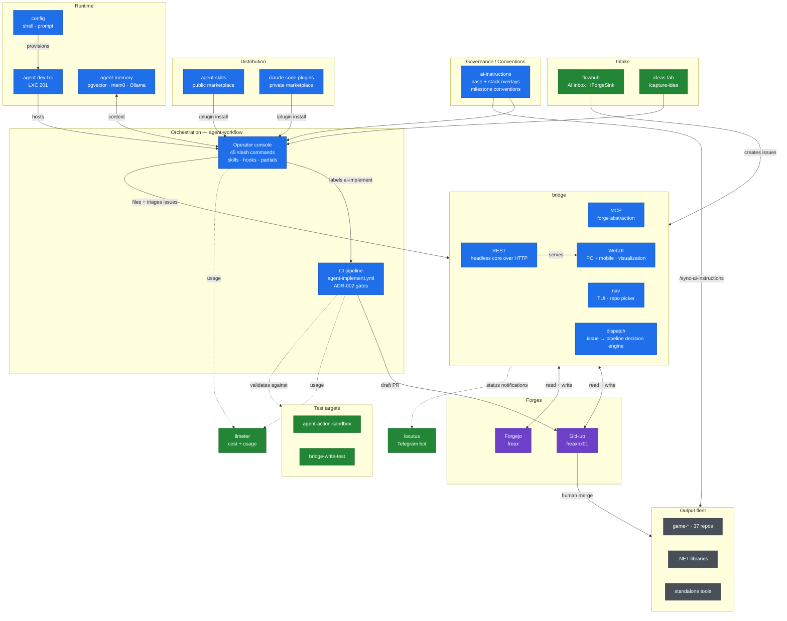

# Software Factory — Repo Map

**Status:** living document · **Last scanned:** 2026-07-30 · **Scan method:** `bridge mcp serve` (`list_repos` across both forges)

The authoritative answer to "which repos make up the factory, what does each own, and what is the boundary between them."

Everything here was derived from a live cross-forge scan. When it goes stale, re-scan rather than trusting this file — see [Re-scanning](#re-scanning).

---

## Scope

A repo is **in the factory** if it produces or governs the pipeline that builds other software. A repo that is *built by* the pipeline is **output**, not factory.

Explicitly out of scope, though adjacent:

| Repo | Why it's out |
|---|---|
| `org` (Forgejo) | Personal planning repo. Not a pipeline component. |
| `obsidian-it`, `obsidian-homelab`, `obsidian-me` | Knowledge vaults. Inputs to thinking, not to the build. |

---

## Diagram



Blue = core · green = supporting · purple = forges · grey = output.
Dotted edges are observation/validation rather than data flow.

[Standalone fullscreen page](http://github.freaxnx01.ch/agent-workflow/) — diagram
only, no other page chrome; press F11 for browser fullscreen.

Two properties worth noting, both visible here and not in the tables below:

- **`bridge` sits between nearly everything and the forges.** Console, flowhub
  and chat sessions all route through it. Useful as a chokepoint, but it also
  makes `bridge` a single point of failure for the whole read/write path — and
  it is why the multi-client blast radius in freaxnx01/bridge#223 matters.
- **The CI path is GitHub-only.** Most Forgejo repos have no runner, so
  `ai-implement` does nothing there; `bridge` and humans are the only writers
  on that side.

## Core (7)

| Repo | Forge | Layer | Owns |
|---|---|---|---|
| **agent-workflow** | GH public | Orchestration | The whole Issue-to-PR pipeline. Two halves in one repo (ADR-005): the **CI side** (`.github/workflows/`, `.github/actions/`, `scripts/`, `gate-tests/`) and the **operator console** (`commands/` — 45 forge-agnostic slash commands, `skills/`, `hooks/`, `partials/`, `setup/`). Also the one-URL machine bootstrap. |
| **agent-memory** *(rename pending — see ADR-F001)* | GH public | Memory | Semantic memory stack: pgvector + mem0 + Ollama, exposed as an MCP server. Session Stop hook. Runs on `agent-dev` LXC 201. |
| **agent-skills** | GH public | Distribution | Public plugin marketplace `freax-agent-skills`. Sharable, non-personal skills (`sync-ai-instructions`, `propose-ai-instructions`). |
| **ai-instructions** | GH public | Convention SoT | `base-instructions.md` + per-stack overlays, `.ai/skills/` (`commit`, `push`, `release-notes`), milestone and issue-title conventions. |
| **bridge** | GH public | Cockpit + forge abstraction | Repo picker and agent-session launcher: fzf/TUI navigation, tmux slots, worktrees, presence and sync. `bridge dispatch` is the issue-to-pipeline decision engine. Surfaces: `nav` (TUI), REST, WebUI, `locutus` (Telegram), and `bridge mcp serve` — the last being the cross-forge tool layer this map was scanned with, and only one surface of several. |
| **agent-dev-lxc** | FJ private | Infrastructure | Proxmox LXC provisioning + setup for the agent container. |
| **claude-code-plugins** | GH private | Distribution | Personal (non-public) plugin marketplace. Counterpart to `agent-skills`. |
| **config** | GH public | Machine setup | Shell, oh-my-posh prompt, Windows tooling. **No Claude content** — that all lives in `agent-workflow`. |

### Factory repos are implemented by Claude

Every repo in the table above runs `agent: claude` in its `agent.yml`, not the
cheap fleet default. These are the tooling every other repo's pipeline runs on,
so a bad implementation here propagates to every consumer rather than staying in
one product. The measurement behind the fleet default (#294 — `glm-5.2` shipped
15 of 18 runs at $4.25, against 59% for `claude-opus-4-7` at $181.70) still holds
for **product** repos; it just isn't the trade to make on the factory itself.

Two traps when setting this on a consumer:

- **`agent:` defaults to `opencode`** in the reusable workflow. Setting only
  `default-model: claude-sonnet-5` without `agent: claude` asks for a Claude
  model from the opencode runner.
- **Omitting `OPENROUTER_API_KEY` looks like it works.** `classify-agent.sh`'s
  credential guard falls back to Claude when the key is absent, so a repo can
  run Claude by accident and flip to the fleet default the moment that secret is
  added for any reason. Declare `agent: claude` explicitly rather than relying on
  a missing credential.

Selecting `claude` also re-enables `classify-task.sh`'s keyword escalation, which
is Claude-only — under `opencode` every run is pinned to the default model with no
per-task triage.

> **Note on the `bridge` row.** An earlier revision of this map described
> `bridge` as "a Go MCP server". That was wrong, and it was wrong for a
> reproducible reason: an assistant holding `bridge mcp serve`'s tools in
> context inferred the whole repo from the one surface it could see, and
> then flagged the repo's *accurate* GitHub description as stale. If you are
> an agent reading this file, note that the scan method line above names a
> subcommand, not the product.

## Supporting (5)

| Repo | Role |
|---|---|
| **flowhub** | .NET 10 / Blazor / pgvector AI inbox. Capture-to-route front door; `IForgeSink` makes it a *producer* of work into the factory. |
| **llmeter** | Unified LLM cost & usage across Anthropic, OpenRouter, Mistral via local LiteLLM. The observability leg. |
| **agent-action-sandbox** (private) | Throwaway consumer repo for testing reusable workflows end-to-end. |
| **ideas-lab** (private) | Idea intake. Backs `/capture-idea`. |
| **bridge-write-test** (FJ, private) | Smoke-test target for `bridge` write operations. |

## Undecided

| Repo | Status |
|---|---|
| **build-ci** | **Revisit — see ADR-F002.** Not empty, as an earlier revision of this map claimed. It builds an Alpine base image and pushes it to `ghcr.io/freaxnx01/build-ci/build-ci:latest`. Whether it stays depends on whether anything still pulls that image. |

## Output fleet

Built *by* the factory, not part of it. Useful as a consumer fleet to validate the pipeline against.

- ~37 `game-*` repos (browser games, plus `civil-war-battlefield` in Godot)
- .NET libraries: `common`, `CommonLibrary`, `Extensions`, `PersonalLibrary`, `dotnet-scripts`, `CodeConverterSingleFile`, `SampleWebNano`, `StringKing`
- Tools: `quicktask-vikunja`, `screenpresso-localsend`, `signal-chat-to-telegram`, `mgrabber-nextgen`, `MusicGrabber`, `SaveOutlookCalendar`, `Digital-Signage`
- Homelab config: `mydocker-compose`, `mailcow-config`, `debian-install`, `linux-scripts`, `powershell`, `traefik-example`
- Web: `quotes`, `freaxnx01.github.io`, `github-pages-example`

---

## Decisions

### ADR-F001 — `agent-os` to `agent-memory`

**Status:** accepted, confirmed by `list_tree`, not yet executed

**Context.** `agent-os` declared five phases. Four had been overtaken by other repos while only Phase 1 was ever built:

| Phase | Declared status | Actually owned by |
|---|---|---|
| 1. Semantic memory | in progress | **`agent-os` — genuinely unique** |
| 2. Skill registry | planned | `agent-skills` + `agent-workflow/skills/` |
| 3. Tool registry | planned | `bridge` + the MCP proxy (LXC 130) |
| 4. Observability | planned | `llmeter` |
| 5. Orchestrator pipeline | planned | `agent-workflow` |

Zero open issues, so no tracked work sat behind phases 2–5. The "OS" name claimed a scope the repo did not have and put it in notional competition with `agent-workflow`.

**Confirmed 2026-08-11.** A recursive `list_tree` shows the repo contains exactly
one substantive tree: `memory/` (docker-compose, `mem0-mcp/` server, Ollama and
Postgres service definitions, `hooks/post-session.sh`). There is no `skills/`,
`tools/`, `observability/` or `pipeline/` directory. The phase table was
aspiration, never scaffolding.

**Decision.** Rename to `agent-memory`. Scope to the memory stack. Delete the phase table.

**Execution notes.**

- `gh repo rename` — `bridge` has no `update_repo` tool yet (freaxnx01/bridge#219), so this is manual either way.
- Once renamed, `agent-memory/memory/` is a redundant prefix. Promote the contents to the repo root, or accept the nesting deliberately.
- `memory/init/01-extensions.sql` and `memory/services/postgres/init/01-extensions.sql` are the same blob (identical sha `0aa0fc22`). Leftover from a restructure; one is dead. Delete whichever the compose files do not reference.
- Update the `agent-workflow` "Related repos" table and the Forgejo mirror after the rename.

**Consequence.** Memory is the one capability nothing else covers — this narrows the repo without demoting it. If the factory is to accumulate context across sessions rather than restart cold, this is load-bearing.

### ADR-F002 — `build-ci` — superseded, needs a new decision

**Status:** **the original decision was based on a false premise. Do not act on it.**

**Original decision (2026-07-30).** Archive `build-ci` as an empty shell.

**Why it was wrong.** The "empty" finding came from five guessed `read_file`
calls that happened to miss the two files that mattered. At the time `bridge`
had no directory listing, and the guesses were treated as conclusive rather
than as a gap. A recursive `list_tree` on 2026-08-11 shows the repo actually
contains:

| Path | What it is |
|---|---|
| `Dockerfile` | `FROM alpine` + `bash`, `curl`, `unzip` |
| `.github/workflows/docker-image.yml` | Builds and pushes `ghcr.io/freaxnx01/build-ci/build-ci:latest` on every push to `main` |
| `.github/workflows/agent.yml` | Consumer stub — already correctly named, so this repo is *not* affected by the `claude.yml` trap below |
| `README.md` | One line, which is what made the repo look abandoned |

So it is a small CI base-image builder, not a placeholder.

**The actual open question.** Does anything still pull that image? The repo is
otherwise untouched — `actions/checkout@v2` has been deprecated for years,
which suggests nothing has needed it in a long time.

- **If something pulls it:** it is live infrastructure. Keep it, and give it a
  README that says what the image is for. It belongs in Supporting, not here.
- **If nothing pulls it:** archive — but for *unused*, not for *empty*. The
  distinction matters because "empty" implied deleting cost nothing.

**Lesson recorded.** Absence of evidence from guessed paths is not evidence of
absence. This is the concrete case behind the "read before you assert" rule in
[`ADVISOR-PROMPT.md`](ADVISOR-PROMPT.md).

### ADR-F003 — One CI home

**Status:** accepted

`claude-pipeline` to `agent-pipeline` to `agent-workflow`. There is no separate pipeline repo. Any reference to `claude-pipeline` or `agent-pipeline` is stale and should be corrected — see [Rename cleanup](#rename-cleanup).

### ADR-F004 — This map lives in git, not in a chat

**Status:** accepted

Chat sessions with `bridge` access are an excellent *workbench* — live cross-forge state, no pasting, eight repos cross-referenced in a turn. They are a poor *filing cabinet*: context fills (a single `list_repos` is ~85 repos of JSON), and assistant memory across sessions is a lossy summary, not a record.

Because `bridge` can re-scan on demand, conversation history is not the continuity mechanism — **the repos are.** Therefore: decisions get written here and committed; sessions stay short and topic-scoped; the next session starts by reading this file, not by re-deriving it.

The companion to this decision is [`ADVISOR-PROMPT.md`](ADVISOR-PROMPT.md), which
holds the working rules for those sessions — including the failure modes that
made "read before you assert" a written rule rather than an assumption.

---

## Rename cleanup

Known remnants of the pre-rename naming. Not exhaustive — found by reading `docs/CONSUMER-SETUP.md` by hand, because `bridge` has no code search (freaxnx01/bridge#221).

**Run this first to get the real list:**

```bash
cd ~/repos/github/freaxnx01/public/agent-workflow
grep -rn 'claude-pipeline\|agent-pipeline\|claude\.yml\|claude-implement' . --exclude-dir=.git
```

| Remnant | Verdict |
|---|---|
| `agent-action-sandbox` repo description names `freaxnx01/claude-pipeline` | **Fix.** Pure stale text. Blocked on freaxnx01/bridge#219, or use `gh repo edit`. |
| `claude-implement.yml` | **Keep.** Deliberate forwarding shim to `agent-implement.yml`, same inputs/secrets/outputs. Removed at v2. |
| `claude.yml` consumer stub | **Fix in consumers.** Live trap: retry-on-rate-limit and chain-dispatch both redispatch `agent.yml`, so a consumer still on `claude.yml` gets silent 404s on retry and chaining (initial run still works). Retry's target is *not* consumer-overridable, so renaming the stub is the only complete fix. |
| `.claude-auto-merge-blocklist` | **Defer.** Renaming is a breaking change for every consumer that has one. Do it at v2 with the shim removal. |
| `name: Claude` / `jobs: claude:` in stub examples | **Fix.** Cosmetic, but it's what every new consumer copy-pastes. |
| Truncated sentence in `CONSUMER-SETUP.md` §1 | **Fix.** `> **Rename in progress:** the agent-workflow references below are the` stops mid-clause. Half-finished edit. |

**Sequencing.** Do the docs/description fixes now; batch the two breaking renames (`.claude-auto-merge-blocklist`, shim removal) into v2 so consumers absorb one migration, not three.

---

## Open work

| Item | Where |
|---|---|
| `update_repo` — repo metadata writes | freaxnx01/bridge#219 |
| `search_code` — cross-repo grep (forge parity problem; design decision needed) | freaxnx01/bridge#221 |
| Non-breaking rename sweep | freaxnx01/agent-workflow#205 |
| Stub-name warning | freaxnx01/agent-workflow#206 |
| v2 breaking renames (tracking) | freaxnx01/agent-workflow#207 |
| Execute ADR-F001 rename (+ the two cleanup items in its execution notes) | — |
| Decide `build-ci`: check whether anything pulls its ghcr image (ADR-F002) | — |

**Shipped since this map was first written:**

- `put_file` — gated direct-to-default writes within a path allowlist
  (freaxnx01/bridge#223, closed by PR #228; follow-ups in #229). This file
  is now editable directly from an MCP session.
- `list_tree` — directory listing (freaxnx01/bridge#220).

**Unreconciled:** freaxnx01/bridge#217 (attachments + generic repo file writes)
overlaps #223. Close one as duplicate or split the scope explicitly.

Every open issue title across the factory (except `ideas-lab`'s raw
`Game idea: ...` capture titles, kept as-is by design) now follows
Conventional Commits (`ai-instructions`' new Issue Title Conventions
section).

### Known `bridge` quirks

- `create_issue` / `create_repo` return Go zero-value timestamps
- Label creation is silent on typos
- `cross_forge_status` TODO.md parser drops some multi-line items
- `forge` parameter is case-sensitive
- `list_issues` returns **titles only** — no bodies, labels or dates, so
  ranking work from a `list_issues` result alone is unreliable
- `list_git_forges` reports a per-forge capability list that is **not** a
  complete tool inventory; do not use it to conclude a tool is missing
- The MCP server has hung and dropped tools mid-session. If a call hangs,
  stop writing — a timed-out `put_file` leaves commit state unknown.

---

## Re-scanning

This file is a snapshot. To refresh it in a new session:

```text
Read docs/ADVISOR-PROMPT.md and docs/FACTORY-MAP.md in freaxnx01/agent-workflow,
then follow it. Today: re-scan and report drift.
```

`ADVISOR-PROMPT.md` carries the working rules; this file carries the state.
One `list_repos` call re-derives the ground truth. Update the map, commit,
move on.
